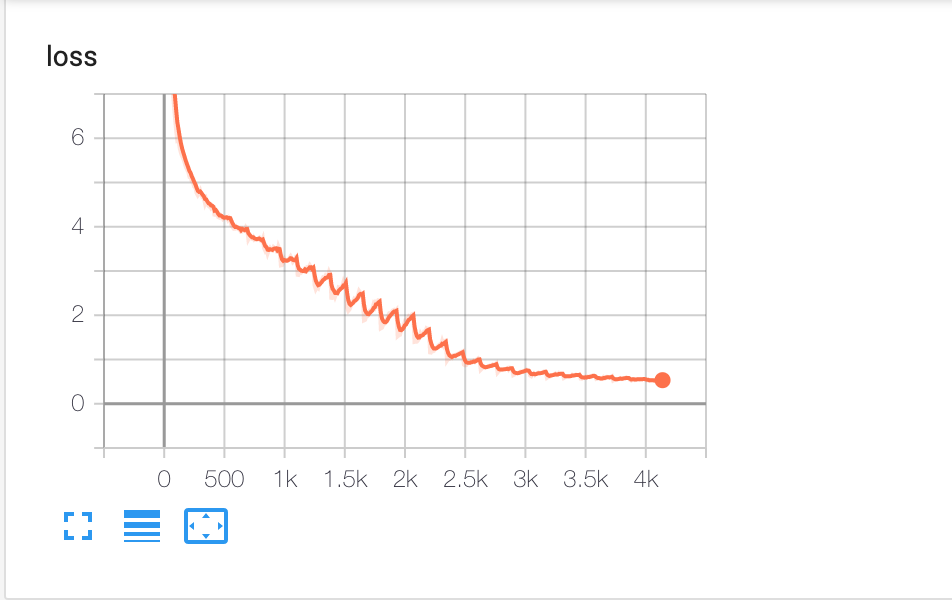

# Rap Generator with GPT2

### Description

In this repo, we got a gap generator with [GPT2-Chinese](https://github.com/Morizeyao/GPT2-Chinese). This generator is a retrained version of GPT-Chinese based on 51426 chinese rap lyrics from 2750 songs.

### Dataset & Exploratory Analysis

The dataset was scrapped from [Xiami](www.xiami.com) because they have a specific genre called "Chinese hip-pop" which means we don't have to put a lot of effort on classifying songs. If you want to see how the scrapper works, you could find it in `preprocessing/xiami_scrawl_rap_lyrics.ipynb`. In that notebook, I also did some exploratory analysis about chinese rap lyrics. 

* Word Frequency  


 Based on the result, we could see that a lot of chinese rappers are focusing on "自己"，"我们"，"生活". Ummmm, seems positive? This surprised me a little bit. After all, in my mind, I thought most of rap lyrics are aggressive (I know, it's kinda of stereotype). Anyhow, data always tells us the truth. 

*  Rhyme Frequency


Rhyme/flow definitely is the most important part of rap. We could see that double i should be the most frequent rhymes used in chinese rap lyrics, such as "世纪"， "自己 ".

### Model & Train 

As I stated before, the repo retrained [GPT2-Chinese](https://github.com/Morizeyao/GPT2-Chinese) model. Architecture and the general training process followed that repo's instruction. Since rap lyrics datset is small and the length of lyric is short, I changed some parameters of training to make the model fit our task. The command I used in training is:

```shell
!python ./train.py --raw --min_length=5 --epoch=30 --num_pieces=1 --stride=10 --batch_size=500 --lr=0.001 --log_step=10
```

And I also changed `n_ctx` and `n_positions` to be 12 because the original gpt2-chinese repo split the dataset into pieces to train. These parameters play an important role in training. 

My final model and specific configuration could be found in `model/final_model/`. The loss of training process is shown as below:



 ### Generate Rap

Here, in order to generate rap with rhyme, I revised the original `generate.py` in GPT2-Chinese. In my script, I used the **rollback scheme** to rhyme the generated lyrics. That is to say, if the last word of one sentence does not follow the rhyme pattern user input, the generator would roll back to the last sentence and then regenerate a new line. 

And what's more, my gernerator supports two modes, lucky mode and unlucky mode. How to use them? 

* Lucky model = 'I do not care about rhyme. Just give me something!'

  ```shell
  !python ./generate.py --length=50 --nsamples=1 --prefix='争执不断' --lucky_mode
  ```

  Here, length is the total length of generated text. 

* Unlucky mode = 'I could not accept the rap lyrics without rhyme!'

  ```shell
  !python ./generate.py --length=7 --nsamples=1 --prefix='争执不断' --rhyme_pattern='ABABCCC' 
  ```

  Here, length is the length of generated **sentence**. rhyme_pattern is the pattern you want. 


### Yayyyy! Results

Yayyyyyy! We finally got here! Let's see how the model performs! 

* Lucky Mode

  * 我的生活

  

  * 争执不断

  

* Unlucky Mode

  

Is it amazing? It really surprised me somehow! 

### Acknowledge

Again, a lot of codes in this repo are borrowed heavily from [GPT2-Chinese](https://github.com/Morizeyao/GPT2-Chinese). If you want to know more about GPT2-Chinese, I strongly recommend that you should read the original code in that repo. And a big THANK YOU to [google colab](https://colab.research.google.com/) for their free GPU support! All of my training, preprocessing and scrapping processes were done on colab. It's really amazing! One thing needed to state, the idea of rhyme scheme was inspired by [Tong-Music](https://github.com/jianyq/Tong-Music). This author also did a lot of works on lyrics generation, if you're interested, please don't be hesitated to check it!

### Something Else...

Now this is just an alpha version of this repo. Next, I would like to:

* Make it browser-interactive
* Keep improving the performance of the model


 

  

  


 


